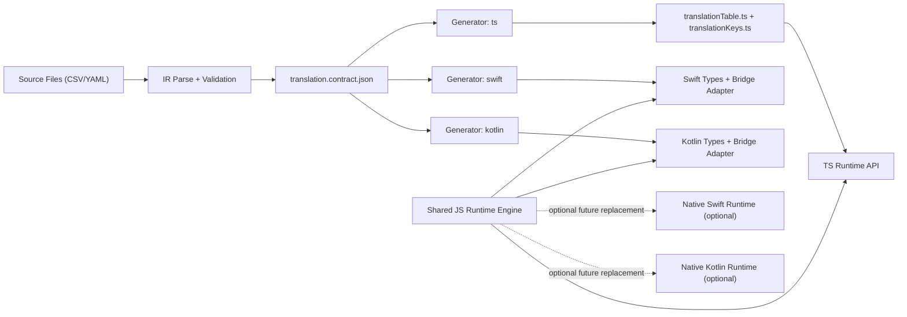
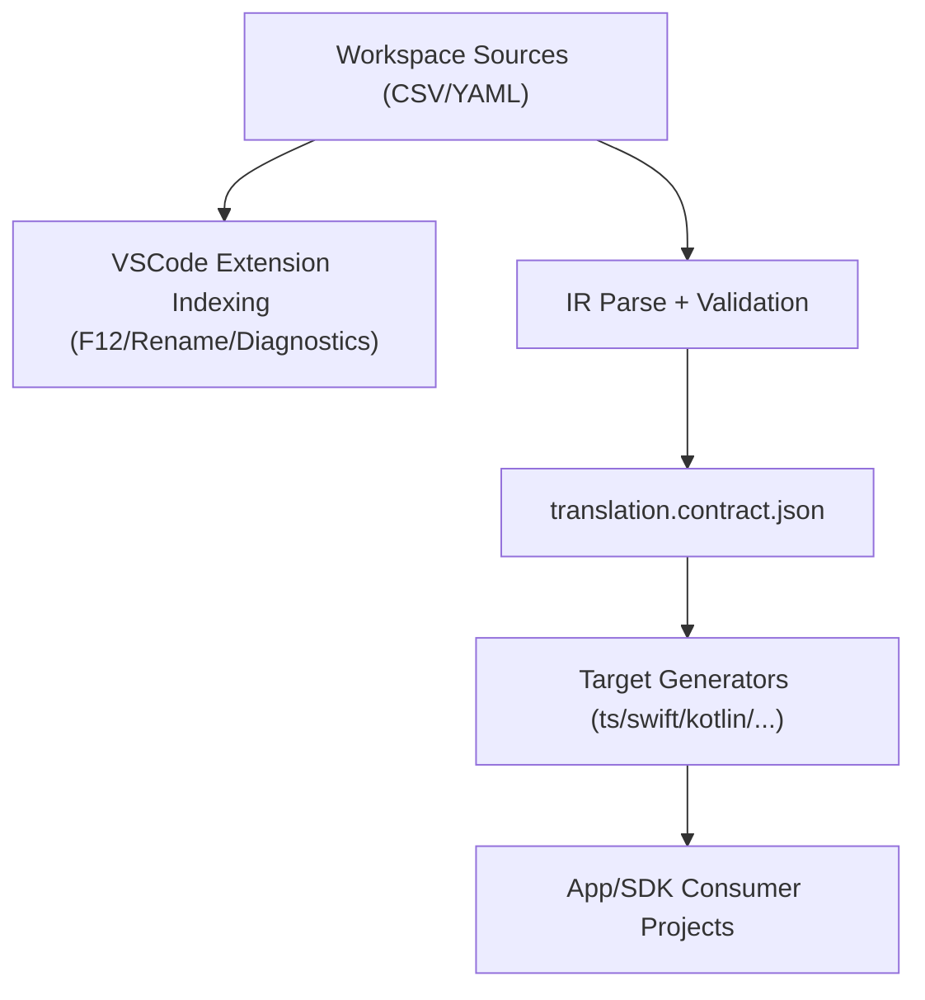
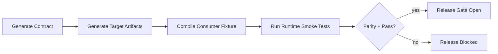

# Typekit i18n - Roadmap

Last sync: 2026-02-15

## Status Summary

- Completed baseline: monorepo setup, TS runtime, CSV/YAML codegen, IR validation, CLI (`generate|validate|convert`), tests, docs-site + GitHub Pages workflow.
- Major complexity driver: ICU runtime is now core behavior (parser + renderer + formatters + locale mapping).
- Primary strategic gap: release/distribution maturity and explicit cross-target parity hardening for native/runtime fixtures.

## Completed (verified against current repository)

### Foundation and Package Layout

- [x] Workspace split into `packages/typekit-i18n`, `packages/typekit-i18n-vscode`, `apps/playground-ts`, `apps/docs-site`.
- [x] Root scripts for `gen/build/lint/typecheck/test/check` are in place.
- [x] `packages/typekit-i18n` is the consolidated publishable package target.

### Runtime and API

- [x] Stable translator API via `createTranslator(...)`.
- [x] Missing translation strategy (`fallback` / `strict`) with reporting hooks.
- [x] Runtime configuration and missing-event collection API.
- [x] ICU translator implemented (`createIcuTranslator(...)`) with `select`, `plural`, `selectordinal`, number/date/time formatting, plural `offset`, escaping, and detailed syntax errors.

### Codegen, IR, Validation, CLI

- [x] Typed config helper + config auto-discovery.
- [x] Deterministic multi-file generation from CSV and YAML.
- [x] IR parsing + validation with placeholder consistency checks.
- [x] CLI commands implemented: `generate`, `validate`, `convert`.
- [x] Shared runtime bridge artifact generation (`translation.runtime.mjs`) for native targets, backed by JS runtime (`createIcuTranslator`/`createTranslator`).
- [x] Direct-eval runtime bridge bundle generation (`translation.runtime.bundle.js`) for JavaScriptCore/embedded engines without ESM import support.

### Quality and Documentation

- [x] Runtime and codegen test suites are present and expanded.
- [x] Docs site and package docs reflect current runtime/codegen APIs.
- [x] GitHub Pages workflow for docs deployment is present (`.github/workflows/pages.yml`).
- [x] Native runtime smoke fixtures exist for Swift, Kotlin, and Java (`tests/fixtures/smoke-runtime`) and are executable via shared runner.

## Legacy Multi-Target Audit (2026-02-14)

### Findings

- `scripts/codegen/generate-api-manifest.mjs` and `scripts/codegen/generate-swift-api.mjs` are tied to legacy paths and assumptions (`ts/...`, Helio-specific output paths), not to current IR/codegen APIs.
- `scripts/codegen/build-all.sh` depends on legacy files (`ts/main.ts`, legacy translation generation, legacy iOS copy flow) and is not part of current package scripts.
- `scripts/ios/copy-js-bundle.sh` is Helio-specific and not integrated into the current `packages/typekit-i18n` release/build contract.
- Result: current Swift/Xcode fragments are useful as historical reference only, but are not a safe base for new platform support.

### Decision

- [x] Freeze legacy scripts as reference-only.
- [x] Reintroduce Swift/Xcode only via the modern IR/codegen pipeline (no direct continuation of legacy script outputs).

## Architecture Direction: Single Source of Truth

### Architecture Overview

### Editor vs Build Tooling Boundary

### Canonical artifact

- [x] Add a target-neutral generated artifact from IR, for example `translation.contract.json`.
- [x] Contract v1 includes:
  - [x] schema version
  - [x] languages and source language
  - [x] optional locale mapping per language
  - [x] keys + categories
  - [x] placeholder metadata per key
  - [x] optional workflow metadata (`status`, `tags`)

### Code ownership boundaries

- [x] Keep parsing, validation, placeholder rules, and ICU scope in one core implementation (`packages/typekit-i18n`).
- [x] Target generators only transform the canonical contract into target-specific API layers.
- [x] Do not duplicate ICU parsing/formatting logic per target in v1; adapters call shared JS runtime unless explicitly promoted to native runtime later.

### Generator extensibility

- [x] Add generator plugin entry points:
  - [x] `typekit-i18n generate --target ts`
  - [x] `typekit-i18n generate --target swift`
  - [x] `typekit-i18n generate --target kotlin`
- [ ] Add deterministic snapshot tests for each target based on the same contract fixture.

## Swift/Xcode Reintroduction Plan

### P0 - Contract and CLI foundation

- [x] Implement canonical contract emission in codegen (`generate` writes TS artifacts + contract).
- [ ] Define compatibility policy for contract versioning and generator minimum supported version.
- [x] Add fixture-based tests that prove TS outputs and contract outputs remain aligned.

### P1 - Swift MVP (Xcode-first, no duplicated business logic)

- [x] Implement `swift` generator from contract:
  - [x] strongly typed key/language/category definitions
  - [x] typed placeholder models
  - [x] translation access API surface compatible with existing TS behavior contracts
- [x] Add a Swift runtime adapter layer for JavaScript execution (`JavaScriptCore`) that consumes generated metadata and calls the shared JS runtime bundle.
- [x] Define error and missing-translation mapping from JS runtime events into Swift-native error/event types.
- [ ] Add sample iOS app integration fixture.
- [x] Add CI smoke test for generated Swift code compilation.
- [x] Generate copy/paste-ready runtime bridge installer so Swift bootstrap remains minimal (load bundle + bridge + translator).

### P2 - Swift hardening

- [ ] Package generated Swift artifacts as Swift Package Manager-friendly output.
- [ ] Add versioned migration notes for contract/schema changes.
- [ ] Evaluate optional native Swift ICU execution only after parity tests pass and duplication risk is accepted.

## Additional Target Environments to Prioritize

### Priority 1 (immediate after Swift contract foundation)

- [ ] Android Studio (`kotlin` generator) with Java interop:
  - [x] generate Kotlin data classes/enums + API wrapper
  - [x] ensure Java-callable facade for mixed Kotlin/Java projects
  - [x] reuse same JS-runtime bridge strategy first (bridge interface in generated target layer)
  - [x] generate shared JS runtime bridge module consumed by Kotlin bridge implementations
  - [ ] add Android project fixture (Gradle/Android Studio) for end-to-end packaging validation
- [ ] Kotlin Multiplatform (shared core model):
  - keep Android and server/desktop Kotlin consumers on one generated contract model

### Priority 2 (high adoption, lower core risk)

- [ ] React Native / Expo helper package:
  - generated typed key/language modules for mobile TS apps
  - optional bridge helpers for native screen integrations
- [ ] Flutter (`dart` generator):
  - generate typed key constants/models
  - runtime adapter strategy decision (JS bridge vs native Dart runtime) behind explicit milestone gate

### Priority 3 (ecosystem expansion)

- [ ] .NET (`csharp` generator) for MAUI/ASP.NET hybrid products.
- [ ] JVM server generator profile (Spring/Ktor) for backend-driven localization validation.
- [ ] Edge/server runtime packaging profiles for Bun/Deno/Cloudflare Workers.

## Open Priorities (re-ranked)

### P0 - Canonical Contract + Multi-Target Safety

- [x] Canonical contract artifact and schema versioning in codegen.
- [ ] TS runtime metadata derived from contract outputs, not duplicated literals.
- [ ] Per-target snapshot and conformance tests from identical fixtures.

### P0 - ICU Runtime Hardening and Scope Guardrails

- [ ] Freeze supported ICU subset as a versioned compatibility contract.
- [ ] Add negative/edge-case matrix across locale behaviors.
- [ ] Add parser/renderer performance guardrails.
- [ ] Document explicit unsupported ICU features.

### P1 - Release and Distribution Maturity

- [ ] Add release workflow (versioning + changelog + publish gates).
- [ ] Lock npm artifact contract (`dist`, exports, CLI entry checks).
- [ ] Add pre-publish validation including codegen drift + docs build.

### P1 - Cross-Target Consumer Validation

- [x] Add per-target consumer fixtures in-repo (`fixtures/consumer-swift`, `fixtures/consumer-kotlin`).
- [ ] CI pipeline per fixture:
  - [x] generate canonical contract
  - [x] generate target artifacts
  - [x] compile consumer project (tool-availability aware `swiftc` / `kotlinc` smoke compilation)
- [ ] Add runtime smoke scenarios per fixture:
  - [x] basic translation
  - [x] placeholder rendering
  - [x] ICU plural/select behavior
  - [ ] missing/fallback behavior parity with JS reference runtime
- [x] Add release gate: no publish when any enabled target consumer smoke test fails.

### P1 - Adoption Assets

- [ ] Add `CONTRIBUTING.md` with contributor workflow and quality gates.
- [ ] Add architecture documentation for runtime/codegen/IR/target-generator boundaries.

### P2 - Translation Workflow Integrations

- [ ] Provider interface for external translation services (outside runtime core).
- [ ] Metadata policy for `status`, `tags`, and ownership.
- [ ] Optional automation for missing key extraction and review reports.

## Next Concrete Steps

1. [x] Implement canonical contract artifact emission and schema tests.
2. [x] Add generator plugin architecture and wire `--target ts` as baseline target.
3. [x] Implement Swift generator MVP from contract + JavaScriptCore adapter smoke test.
4. [x] Implement Kotlin generator MVP with Java interoperability checks.
5. [x] Add consumer fixture CI (Swift + Kotlin) with compile and runtime smoke gates.
