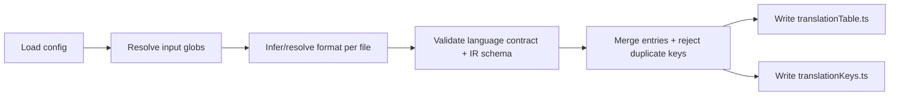
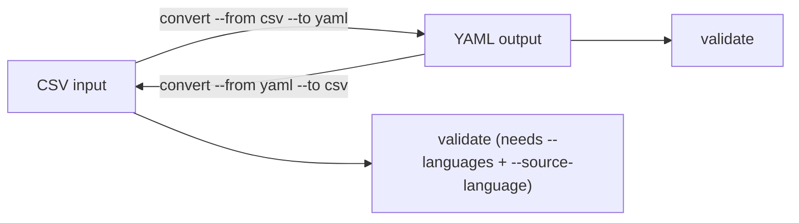

# Codegen + CLI

Codegen imports come from `typekit-i18n/codegen`.

## Config Helper

Use `defineTypekitI18nConfig` for typed language inference:

```ts
import { defineTypekitI18nConfig } from 'typekit-i18n/codegen'

export default defineTypekitI18nConfig({
  input: ['./translations/*.csv', './translations/*.yaml'],
  output: './src/generated/translationTable.ts',
  outputKeys: './src/generated/translationKeys.ts',
  languages: ['en', 'de', 'fr'] as const,
  defaultLanguage: 'en',
})
```

Config fields:

- `input`: file path or glob pattern(s)
- `format?`: optional override (`csv` or `yaml`) for all inputs
- `output`: generated table file path
- `outputKeys?`: generated key/language type file path
- `languages`: supported language list
- `defaultLanguage`: fallback language (must be part of `languages`)

`input` is intentionally multi-file capable so teams can keep translation resources split by feature/domain instead of one monolithic table.

## Config File Discovery

When no explicit `--config` is passed, the CLI checks:

- `typekit.config.ts|json|yaml|yml`
- `typekit-i18n.config.ts|json|yaml|yml`



## CLI Commands

Binary: `typekit-i18n`

### `generate` (default)

```bash
typekit-i18n generate --config ./typekit.config.ts
# or:
typekit-i18n
```

Output:

- `translationTable.ts`
- `translationKeys.ts`

### `validate`

```bash
# YAML
typekit-i18n validate --input ./translations/features.yaml --format yaml

# CSV
typekit-i18n validate \
  --input ./translations/ui.csv \
  --format csv \
  --languages en,de,fr \
  --source-language en
```

For CSV, `--languages` and `--source-language` are required.

### `convert`

```bash
# YAML -> CSV
typekit-i18n convert \
  --from yaml \
  --to csv \
  --input ./translations/features.yaml \
  --output ./translations/features.csv

# CSV -> YAML
typekit-i18n convert \
  --from csv \
  --to yaml \
  --input ./translations/ui.csv \
  --output ./translations/ui.yaml \
  --languages en,de,fr \
  --source-language en
```

When converting from CSV, CSV context args are required.



## Programmatic API

Also available from `typekit-i18n/codegen`:

- `generateTranslationTable(config)`
- `validateTranslationFile(options)`
- `validateYamlTranslationFile(path)`
- `loadTypekitI18nConfig(path?)`
