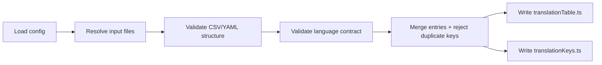

# Codegen + CLI

Codegen imports come from `@number10/typekit-i18n/codegen`.

## Config Helper

Use `defineTypekitI18nConfig` for language inference:

```ts
import { defineTypekitI18nConfig } from '@number10/typekit-i18n/codegen'

export default defineTypekitI18nConfig({
  input: ['./translations/*.csv', './translations/*.yaml'],
  output: './src/generated/translationTable.ts',
  outputKeys: './src/generated/translationKeys.ts',
  languages: ['en', 'de', 'fr'] as const,
  defaultLanguage: 'en',
})
```

Config fields:

- `input`: file path or glob pattern(s)
- `format?`: optional force format for all inputs (`csv` or `yaml`)
- `output`: generated table file path
- `outputKeys?`: generated key/language type file path
- `languages`: supported languages
- `defaultLanguage`: fallback language

Rules:

- `languages` must be non-empty and unique
- `defaultLanguage` must be part of `languages`
- `output` and `outputKeys` must not be identical
- duplicate keys across merged files fail generation

## Config Discovery

When no `--config` is passed, CLI checks:

- `typekit.config.ts|json|yaml|yml`
- `typekit-i18n.config.ts|json|yaml|yml`

## Generation Output

`generate` writes:

- `translationTable.ts`
- `translationKeys.ts`

Generated types include:

- `TranslateKey`
- `TranslateKeys`
- `TranslationCategories`
- `TranslateCategory`
- `TranslateKeysByCategory`
- `TranslateKeyOf`
- `LanguageCodes`
- `TranslateLanguage`

## CLI Commands

Binary name: `typekit-i18n`

### `generate` (default)

```bash
typekit-i18n generate --config ./typekit.config.ts
# or simply
typekit-i18n
```

If no config is found, command exits successfully and skips generation.

### `validate`

```bash
# YAML (format inferred)
typekit-i18n validate --input ./translations/features.yaml

# CSV
typekit-i18n validate \
  --input ./translations/ui.csv \
  --format csv \
  --languages en,de,fr \
  --source-language en
```

CSV validation requires `--languages` and `--source-language` (or `--sourceLanguage`).

### `convert`

```bash
# YAML -> CSV
typekit-i18n convert \
  --from yaml \
  --to csv \
  --input ./translations/features.yaml \
  --output ./translations/features.csv

# CSV -> YAML
typekit-i18n convert \
  --from csv \
  --to yaml \
  --input ./translations/ui.csv \
  --output ./translations/ui.yaml \
  --languages en,de,fr \
  --source-language en
```

For CSV input conversion, CSV context arguments are required.

## Programmatic API

Also exported:

- `generateTranslationTable(config)`
- `validateTranslationFile(options)`
- `validateYamlTranslationFile(path)`
- `loadTypekitI18nConfig(path?)`

## Flow


