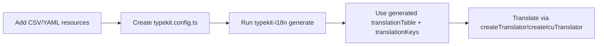

# Getting Started

## Requirements

- Node.js `>= 20.11.0`
- pnpm `>= 10`

## Workspace Setup

```bash
pnpm install
```

Generate package + playground artifacts:

```bash
pnpm run gen:typekit-i18n
```

Run playground:

```bash
pnpm run dev:playground
```

Run docs site:

```bash
pnpm run dev:docs
```

## Minimal Package Setup

### 1. Install package

```bash
pnpm add typekit-i18n
```

### 2. Add translation resources

Example `translations/ui.csv`:

```csv
key;description;en;de
welcome_title;Main title;Welcome;Willkommen
welcome_body;Greeting with placeholder;Hello {name};Hallo {name}
```

### 3. Add `typekit.config.ts`

```ts
import { defineTypekitI18nConfig } from 'typekit-i18n/codegen'

export default defineTypekitI18nConfig({
  input: ['./translations/*.csv', './translations/*.yaml'],
  output: './src/generated/translationTable.ts',
  outputKeys: './src/generated/translationKeys.ts',
  languages: ['en', 'de'] as const,
  defaultLanguage: 'en',
})
```

### 4. Generate table and key types

```bash
npx typekit-i18n
```

### 5. Use translator in runtime

```ts
import { createTranslator } from 'typekit-i18n'
import { translationTable } from './generated/translationTable'

const t = createTranslator(translationTable)

const text = t('welcome_title', 'de')
```

## Flow


