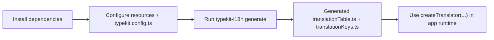

# Getting Started

## Requirements

- Node.js `>= 20.11.0`
- pnpm `>= 10`

## Workspace Setup

```bash
pnpm install
```



Generate translations for the workspace demo:

```bash
pnpm run gen:typekit-i18n
```

Run playground:

```bash
pnpm run dev:playground
```

Run docs site:

```bash
pnpm run dev:docs
```

## Minimal App Setup

### 1. Add package

```bash
pnpm add typekit-i18n
```

### 2. Create translation resources

Example: `translations/ui.csv`

```csv
key;description;en;de
greeting_title;Greeting title;Welcome;Willkommen
greeting_body;Greeting with placeholder;Hello {name};Hallo {name}
```

### 3. Create `typekit.config.ts`

```ts
import { defineTypekitI18nConfig } from 'typekit-i18n/codegen'

export default defineTypekitI18nConfig({
  input: ['./translations/*.csv', './translations/*.yaml'],
  output: './src/generated/translationTable.ts',
  outputKeys: './src/generated/translationKeys.ts',
  languages: ['en', 'de'] as const,
  defaultLanguage: 'en',
})
```

### 4. Run generator

```bash
npx typekit-i18n
```

### 5. Use generated table at runtime

```ts
import { createTranslator } from 'typekit-i18n'
import { translationTable } from './generated/translationTable'
import type { TranslateKey, TranslateLanguage } from './generated/translationKeys'

const t = createTranslator<TranslateLanguage, TranslateKey, typeof translationTable>(
  translationTable,
  {
    defaultLanguage: 'en',
  }
)

const title = t('greeting_title', 'de')
```

## Docs Build for GitHub Pages

When deploying a project site (for example `https://<user>.github.io/typekit-i18n/`), build docs with base path:

```bash
DOCS_BASE_PATH=/typekit-i18n/ pnpm --filter @typekit-i18n/docs-site run docs:build
```

If `DOCS_BASE_PATH` is not set, docs use `/`.
