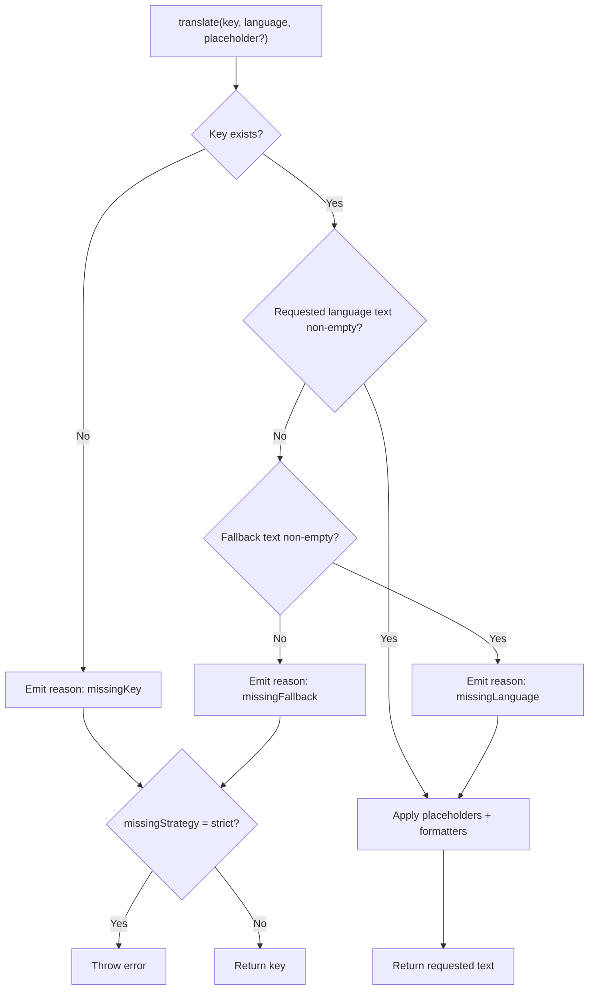
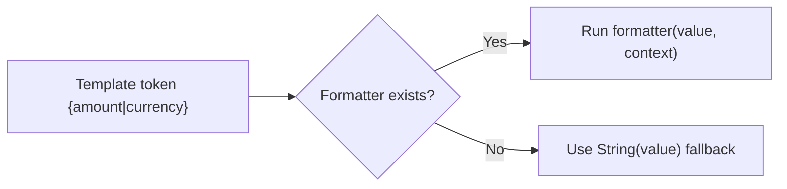

# Runtime API

Runtime imports come from `typekit-i18n`.

## `createTranslator(table, options)`

Creates a typed translator function:

```ts
;(key, language, placeholder?) => string
```

`options`:

- `defaultLanguage: TLanguage`
- `missingStrategy?: 'fallback' | 'strict'`
- `formatters?: Record<string, PlaceholderFormatter>`
- `onMissingTranslation?: (event) => void`

Behavior:

- Returns requested translation when present
- Falls back to `defaultLanguage` when target translation is empty
- Returns `key` when no value can be resolved
- Throws in `strict` mode on missing key/language/fallback



Missing event reasons:

- `missingKey`
- `missingLanguage`
- `missingFallback`

## Placeholder Replacement

Placeholder payload:

```ts
{
  data: [{ key: 'name', value: 'Mara' }]
}
```

Template usage:

- Raw replacement: `{name}`
- Named formatter: `{amount|currency}`

If a formatter is missing, raw string conversion is used as fallback.



## `createTranslationRuntime(table, options)`

Creates an isolated runtime instance with mutable behavior:

- `translate(key, language, placeholder?)`
- `configure(options)`
- `getCollectedMissingTranslations()`
- `clearCollectedMissingTranslations()`

`configure` can update:

- `defaultLanguage`
- `missingStrategy`
- `onMissingTranslation`
- `formatters`
- `collectMissingTranslations`

## Default Runtime Helpers

These helpers operate on the package default generated table:

- `translate(key, language, placeholder?)`
- `configureTranslationRuntime(options)`
- `getCollectedMissingTranslations()`
- `clearCollectedMissingTranslations()`
- `createConsoleMissingTranslationReporter(writer?)`
