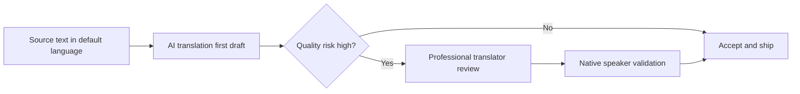

# Translation Strategy

## Why This Matters

Internationalized products need a repeatable way to create and maintain translations at scale.

For most teams, an AI-first workflow is now the most efficient baseline.

## Recommended Approach

Use a two-step model:

1. AI-generated first draft for speed and coverage.
2. Human review for quality-critical content.

## When AI-Only Is Usually Enough

AI-first without mandatory human review is typically sufficient for:

- Internal tools
- Admin dashboards
- Early product iterations
- Non-regulated product copy

## When Human Review Is Mandatory

Add professional and native review for:

- Legal text
- Safety-critical instructions
- Medical and financial content
- Brand-sensitive marketing copy
- Contractual or compliance-relevant wording

## Practical Quality Criteria

Define explicit acceptance checks per locale:

- Meaning preserved from source text
- Terminology consistency
- Placeholder integrity (for example `{name}`, `{amount|currency}`)
- Tone and style alignment with product voice
- No culturally problematic wording

## Integration With `typekit-i18n`

`typekit-i18n` handles structure, typing, validation, and runtime behavior.

Translation source can come from:

- Manual authoring
- AI workflows
- External APIs and localization tools

As long as output follows the CSV/YAML contract, the generation and runtime path stays unchanged.

## File Hierarchy Strategy

Do not keep all content in a single translation table file.

Use multiple files with a user-defined hierarchy, for example by:

- Feature (`auth`, `checkout`, `settings`)
- Product area (`dashboard`, `reports`, `admin`)
- Domain ownership (`billing`, `support`, `legal`)

Benefits:

- Better readability and ownership boundaries
- Lower review complexity per change
- Reduced risk of losing overview in one monolithic table

## Policy Suggestion

Document the translation policy in your repository:

- Which content is AI-only
- Which content requires human review
- Who approves locale releases
- What quality checks block a release
- How translation files are grouped and owned
- Which commit rules apply per file or folder

For enterprise workflows, file-based commit governance is often useful, for example:

- Require specific reviewers for `translations/legal/*`
- Enforce stricter checks for `translations/compliance/*`
- Allow faster merge paths for low-risk UI copy in `translations/ui/*`
